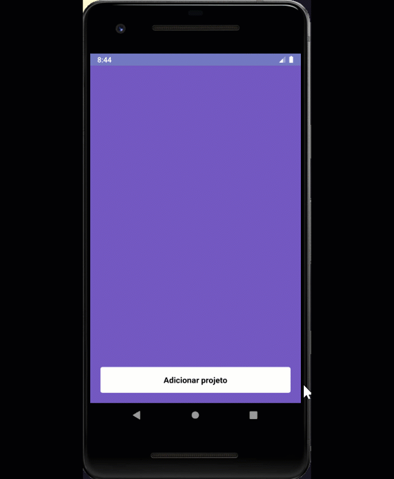

# React Native - A simple test project 
Exercise on React Native for the Bootcamp GoStack - Rocketseat.

Add a record in the backend by clicking the button "Adicionar projeto".
The purpose of the project was to test useState and useEffect. That way, there is no form to add new records.

### Some of the features used in this project: 
&nbsp;&nbsp;React Native components<br>
&nbsp;&nbsp;&nbsp;&nbsp;SafeAreaView<br> 
&nbsp;&nbsp;&nbsp;&nbsp;Text <br>
&nbsp;&nbsp;&nbsp;&nbsp;FlatList <br> 
&nbsp;&nbsp;&nbsp;&nbsp;StyleSheet <br> 
&nbsp;&nbsp;&nbsp;&nbsp;StatusBar <br> 
&nbsp;&nbsp;&nbsp;&nbsp;TouchableOpacity


### Installation
Install and run the back-end:
[simple-test-project-nodejs](https://github.com/rlovatto/simple-test-project-nodejs)


To install all dependencies for this project:

```
yarn
```

To configure the Android emulator network:

```
adb reverse tcp:3333 tcp:3333
```

To run the project:

```
yarn android
```

### Node.js back-end for this project:

[simple-test-project-nodejs](https://github.com/rlovatto/simple-test-project-nodejs)


<br/><br/>

